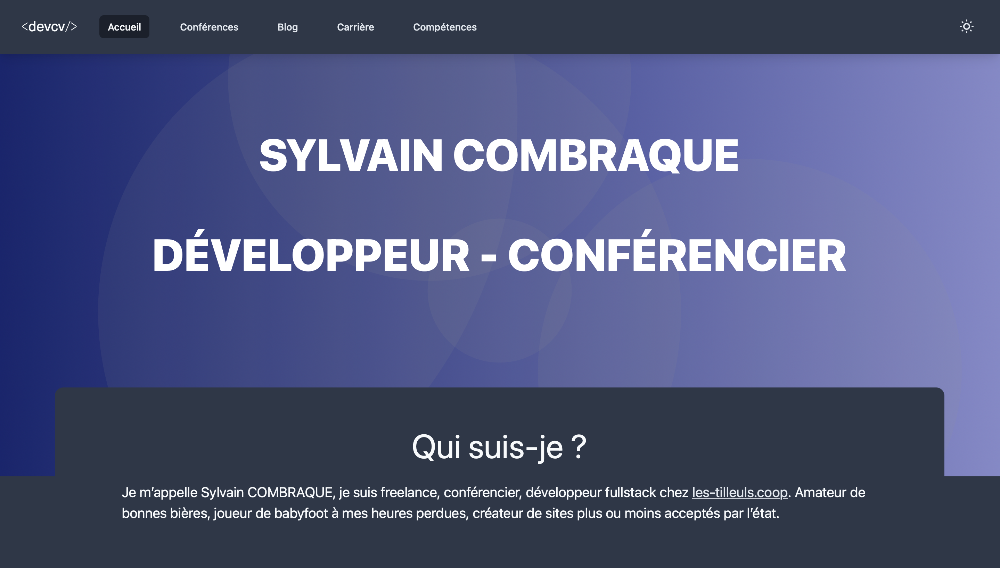
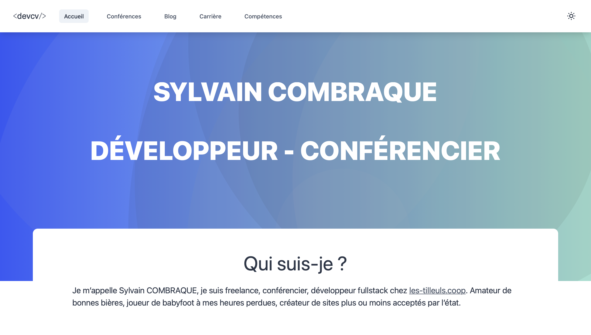

# devcv.fr - HUGO Template

This is a responsive hugo template with the darkmode switcher support, to show my upcoming and past conferences, skills and write some blog posts. CSS powered by Tailwindcss and Turbolinks to looks like a SPA.

## Demo
The fully working demo is available [here https://xenodochial-newton-16b494.netlify.app](https://xenodochial-newton-16b494.netlify.app)

## Technologies in this website
 - Hugo
 - TailwindCSS
 - Gulpjs
 - Netlify
 - Turbolinks
 - Heroicons

## Dark mode

## Light mode

---
You can reuse this theme.
